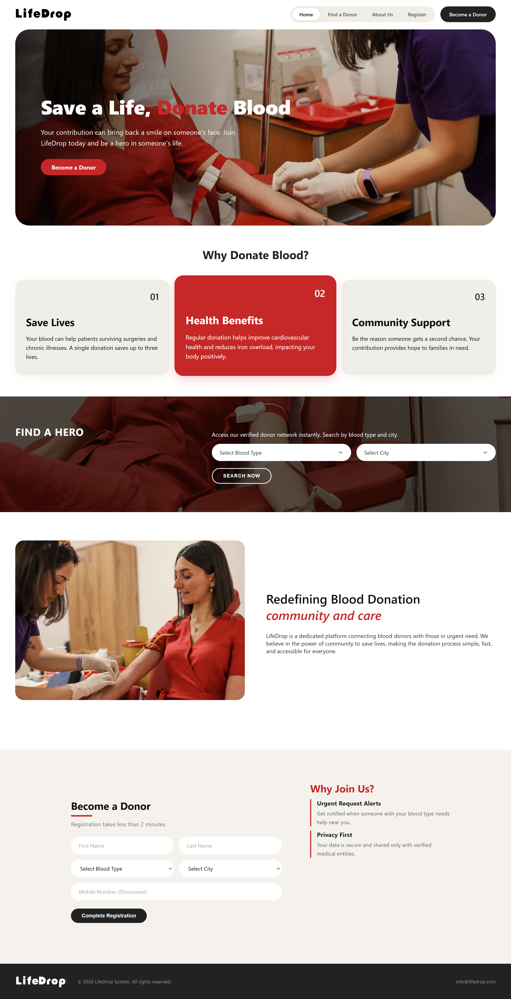

##  LifeDrop – Blood Donation Platform

**LifeDrop** is a full-stack web platform that connects blood donors with people in urgent need, built as a group project for the Web Development course.

---

### About the Website
LifeDrop was built to make blood donation simple, fast, and accessible by connecting a verified donor network with people searching for a specific blood type in their city.

With the site, visitors can:
- Search for donors by **blood type** and **city**
- Register as a donor in under 2 minutes
- Get notified through **urgent request alerts** when someone with their blood type needs help nearby
- Learn more about the platform through the **About Us** section
- Trust that their data is kept private and shared only with verified medical entities

---

### UI Preview

---

### Tech Stack
- **HTML5 / CSS3 / JavaScript** – for page structure and interactivity
- **Bootstrap** – for responsive layout and UI components
- **Node.js / Express** – backend server and API
- **MySQL (via MAMP)** – database for storing donor and request data

---

### Team Project
LifeDrop was developed as a group project for the Web Development course, with a full backend and database to handle donor registration and search.

---

April 2026
